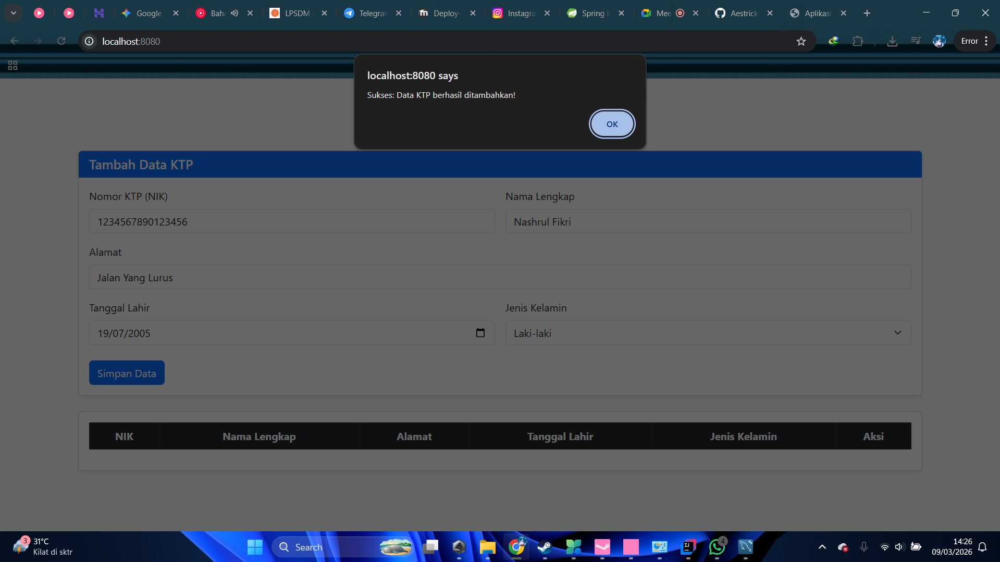
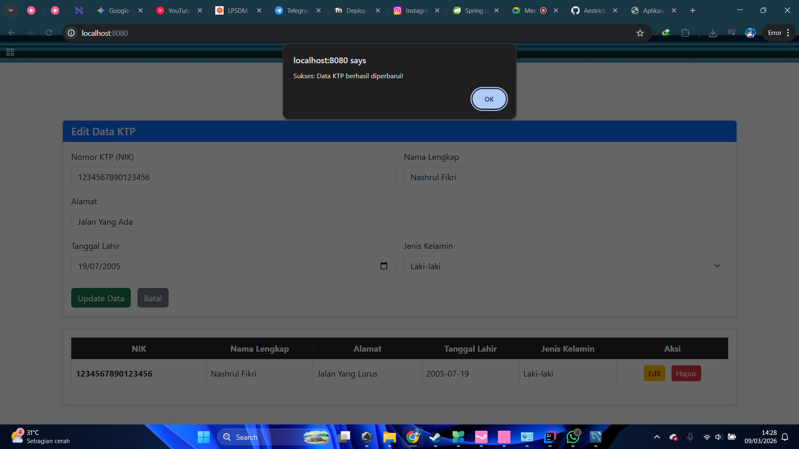
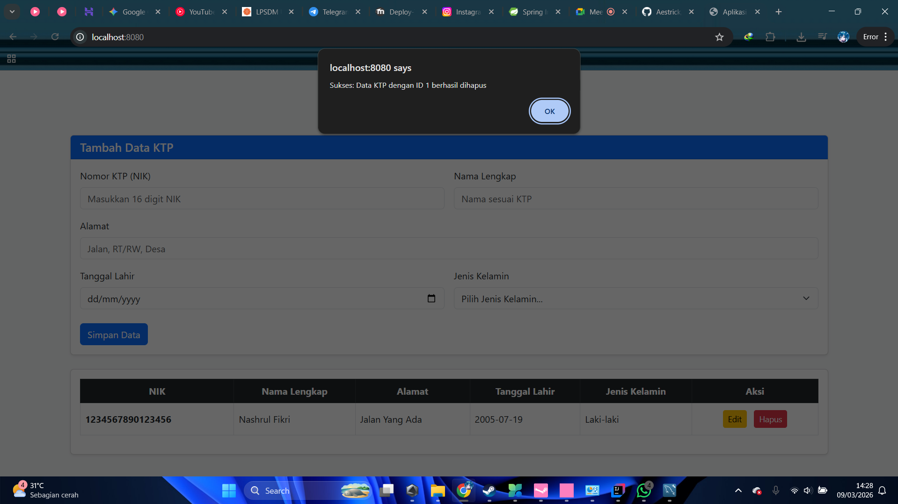
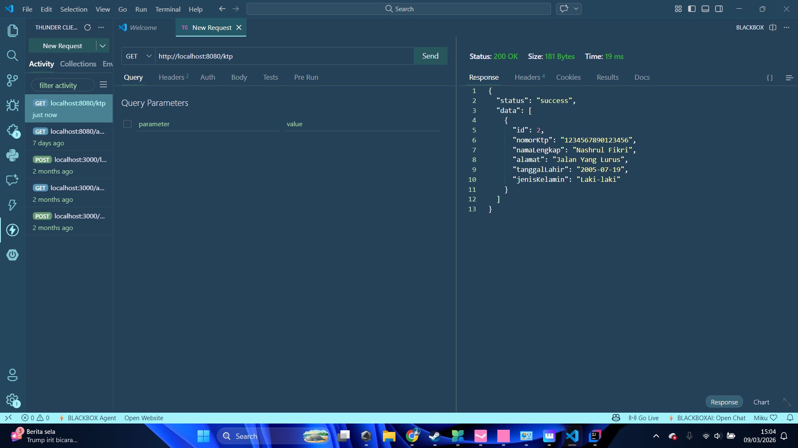

# Tugas Praktikum 2 - CRUD KTP (Deployment Perangkat Lunak)

## 📋 Deskripsi Project
Project ini adalah tugas Praktikum 2 untuk mata kuliah Deployment Perangkat Lunak. Aplikasi ini merupakan sistem manajemen pendataan KTP berbasis web yang mengimplementasikan arsitektur Client-Server.
- **Backend:** Menggunakan Spring Boot untuk RESTful API dan MySQL untuk Database.
- **Frontend:** Menggunakan HTML, Bootstrap CSS, dan JQuery Ajax untuk operasi CRUD Single Page Application (tanpa reload halaman).

## 🛠️ Tech Stack
- **Java:** 21
- **Framework Backend:** Spring Boot 4.0.3
- **Database:** MySQL (Schema: `spring`)
- **Frontend:** HTML5, Bootstrap 5, JQuery Ajax
- **Library Tambahan:** MapStruct, Lombok, Jakarta Validation

## 🚀 Endpoint API RESTful
- `POST /ktp` : Menambah data KTP baru (dilengkapi validasi NIK unik)
- `GET /ktp` : Mengambil seluruh data KTP
- `GET /ktp/{id}` : Mengambil data KTP spesifik berdasarkan ID
- `PUT /ktp/{id}` : Memperbarui data KTP
- `DELETE /ktp/{id}` : Menghapus data KTP

## Screeenshoot

## 👤 Identitas Mahasiswa
- **Nama:** Nashrul Fikri
- **NIM:** 20230140105
- **Prodi:** Teknologi Informasi
- **Instansi:** Universitas Muhammadiyah Yogyakarta